<div align="center">
  
# Hi 👋, I'm Anirudh


</div>

<div align="center">
  
### 🚀 Building the Future with Hardware & Software

*Passionate about creating intelligent embedded solutions*

</div>

---

<div align="center">

## 🎯 About Me

</div>

```yaml
name: Anirudh
education: Electronics & Communication Engineering
interests: [Embedded Systems, AI, Robotics, IoT]
goal: High-paying core tech job in cutting-edge technology
current_status: Learning, Building, Growing 🌱
```

<div align="center">

## 💻 Tech Stack

### Languages


### Hardware & Platforms


### Tools & Technologies


</div>

---

<div align="center">

## 🔥 Currently Learning

</div>

<table align="center">
  <tr>
    <td align="center" width="200">
      
      <br><strong>ARM Cortex</strong>
      <br><sub>Microcontrollers</sub>
    </td>
    <td align="center" width="200">
      
      <br><strong>Robotics</strong>
      <br><sub>Automation & Control</sub>
    </td>
    <td align="center" width="200">
      
      <br><strong>Embedded AI</strong>
      <br><sub>Edge Computing</sub>
    </td>
  </tr>
</table>

---

<div align="center">

## 📊 GitHub Stats


</div>

<div align="center">


</div>

---

<div align="center">

## 🏆 Achievements & Goals

```mermaid
graph LR
    A[🎓 ECE Student] --> B[💻 Embedded Dev]
    B --> C[🤖 Robotics Expert]
    C --> D[🚀 Core Tech Job]
    D --> E[🌟 Tech Innovator]
    
    style A fill:#00D9FF,stroke:#0099CC,stroke-width:2px,color:#000
    style B fill:#00FF85,stroke:#00CC6A,stroke-width:2px,color:#000
    style C fill:#FF6B6B,stroke:#CC5555,stroke-width:2px,color:#000
    style D fill:#FFD93D,stroke:#CCAD31,stroke-width:2px,color:#000
    style E fill:#A18AFF,stroke:#8167CC,stroke-width:2px,color:#000
```

</div>

<div align="center">



</div>

---

<div align="center">

## 🌟 Featured Projects

<table>
  <tr>
    <td width="50%" valign="top">
      <h3 align="center">🤖 Project 1</h3>
      <div align="center">
        
        <br><br>
        <p><strong>Embedded Systems Project</strong> - Description of your cool project here</p>
        <br>
        <p>
          
          
        </p>
      </div>
    </td>
    <td width="50%" valign="top">
      <h3 align="center">🚀 Project 2</h3>
      <div align="center">
        
        <br><br>
        <p><strong>AI Robotics Project</strong> - Description of your next project</p>
        <br>
        <p>
          
          
        </p>
      </div>
    </td>
  </tr>
</table>

</div>

---

<div align="center">

## 📫 Let's Connect

[](https://github.com/YOUR_USERNAME)
[](https://linkedin.com/in/YOUR_PROFILE)
[](mailto:your.email@example.com)

</div>

---

<div align="center">

### 💡 *"Transforming innovative ideas into embedded reality"*


</div>

<div align="center">

### ⚡ Fun Fact
*I believe the future of AI lies in edge devices - bringing intelligence to the smallest of systems!*

</div>

---

<div align="center">


</div>
